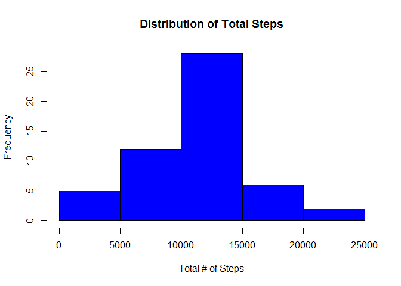
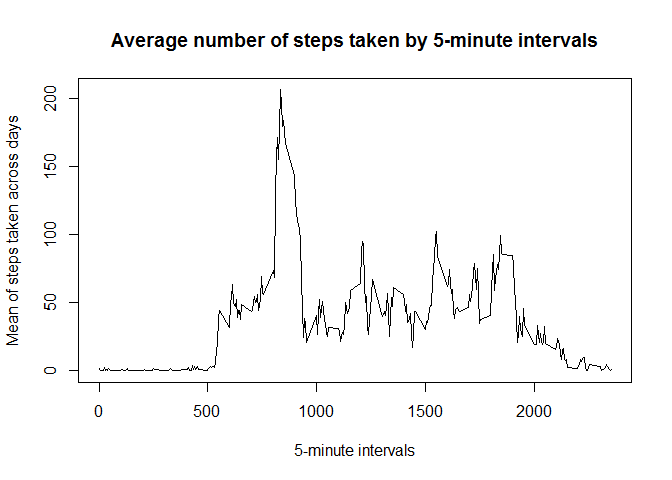
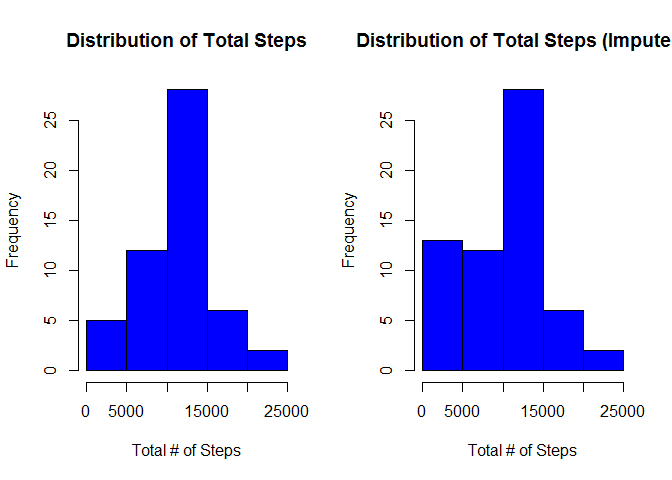
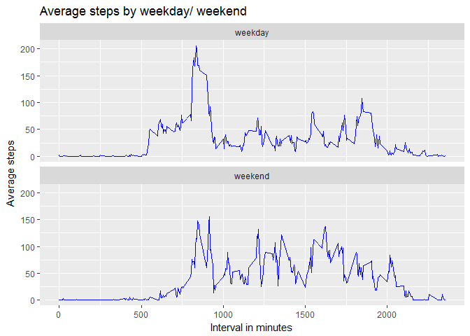

# Reproducible Research: Peer Assessment 1

This file describes the various steps involved in preparing the report required
for Peer Assignment #1 of Reprodcible Analysis course.

The below libraries are needed for this assignment:


```r
library(dplyr)
library(ggplot2)
```

## Loading and preprocessing the data
Reading the activity data and converting date values to "date" format


```r
activity = read.csv(unzip("activity.zip"), na.strings = "NA")
activity$date = as.Date(activity$date)
```

## What is mean total number of steps taken per day?

Aggregating the number of steps taken at the day level and calculating the mean.
This data contains NA values too.


```r
totalStepsDayWise = group_by(activity, date) %>%
      summarise(totalSteps = sum(steps))
meanSteps = mean(totalStepsDayWise$totalSteps, na.rm = T)
medianSteps = median(totalStepsDayWise$totalSteps, na.rm = T)

hist(totalStepsDayWise$totalSteps, col = "blue", xlab = "Total # of Steps",
     main = "Distribution of Total Steps")
```

<!-- -->

Mean steps per day: 10766

Median steps per day: 10765

## What is the average daily activity pattern?

Showing average number of steps taken by time interval.


```r
meanStepsMinWise = group_by(activity, interval) %>%
      summarise(meanSteps = mean(steps, na.rm = T))

plot(x = meanStepsMinWise$interval, y = meanStepsMinWise$meanSteps, 
     type =  "l", xlab = "5-minute intervals", 
     ylab = "Mean of steps taken across days",
     main = "Average number of steps taken by 5-minute intervals")
```

<!-- -->

Maximum number of steps observed at this time: 
835

## Imputing missing values

Each missing value to be replaced with the median of total steps 
taken in that interval across days


```r
medianStepsMinWise = group_by(activity, interval) %>%
      summarise(meanSteps = median(steps, na.rm = T))
activityCompleted = activity

# Going throuh the dataset - finding rows with missing values - 
# finding median steps for those intervals - imputing in the dataset
for (i in 1:nrow(activityCompleted)) {
      if (is.na(activityCompleted[i, 1])) {
            activityCompleted[i, 1] = 
                  medianStepsMinWise[medianStepsMinWise$interval == activityCompleted[i, 3], 2]
      }
}

# Aggregating imputed data by day
totalStepsDayWiseCompleted = group_by(activityCompleted, date) %>%
      summarise(totalSteps = sum(steps))

# Graphs showing differences between the original and imputed dataset
par(mfrow = c(1, 2))
hist(totalStepsDayWise$totalSteps, col = "blue", xlab = "Total # of Steps",
     main = "Distribution of Total Steps")
hist(totalStepsDayWiseCompleted$totalSteps, col = "blue", xlab = "Total # of Steps",
     main = "Distribution of Total Steps (Imputed)")
```

<!-- -->

## Are there differences in activity patterns between weekdays and weekends?

Creating a function to identify rows pertaining to weekdays/ weekends. Imputed
data has been used for this analysis.


```r
getDayType = function (dayVal) {
      dayType = "weekday"
      wkEnd = c("Saturday", "Sunday")
      if (weekdays(dayVal) %in% wkEnd) {
            dayType =  "weekend"
      } else {
            dayType = "weekday"
      }
      dayType
}
activityDayType = activityCompleted
activityDayType$dayType = sapply(activityDayType$date, getDayType)
activityDayType$dayType = as.factor(activityDayType$dayType)
```
Plotting average steps by interval by weekday/ weekend


```r
activityDayTypeAvg = group_by(activityDayType, interval, dayType) %>%
      summarise(avgSteps = mean(steps, na.rm = T))

ggplot(activityDayTypeAvg, aes(x = interval, y = avgSteps)) +
      facet_wrap(~ dayType, nrow = 2) + 
      geom_line(col = "blue") +
      labs(x = "Interval in minutes", y = "Average steps", 
           title = "Average steps by weekday/ weekend")
```

<!-- -->
